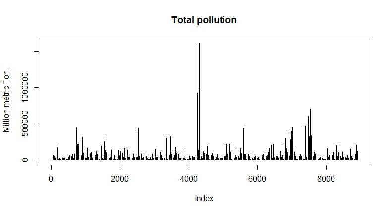
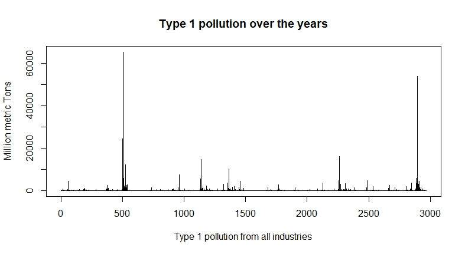
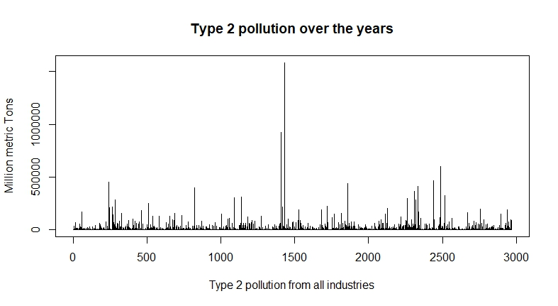
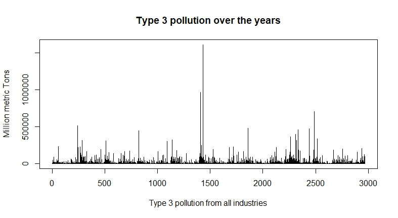
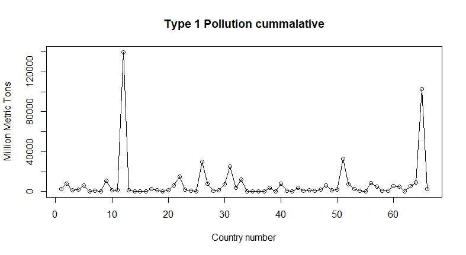
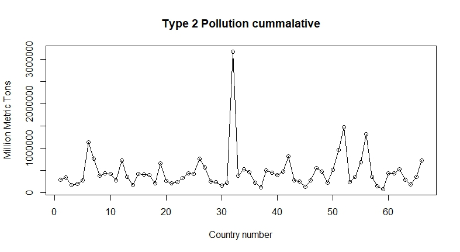
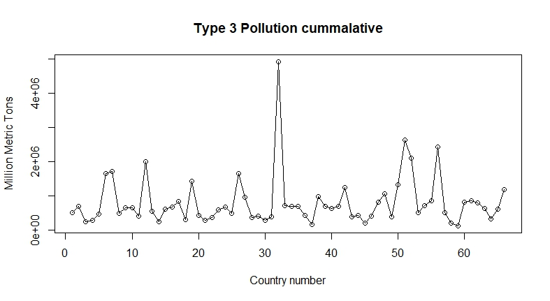
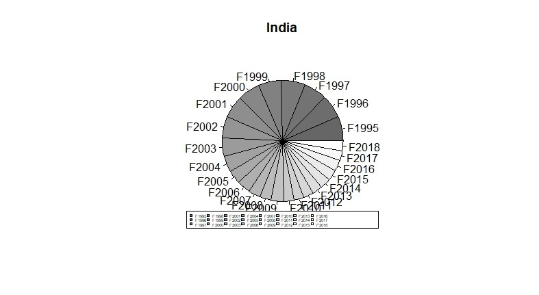
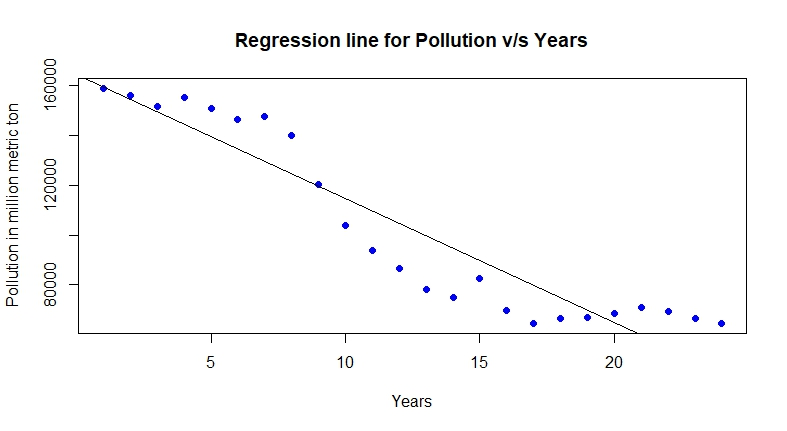
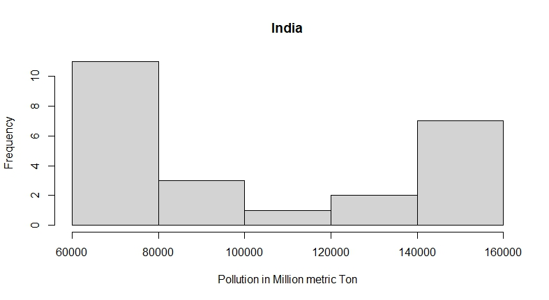

# CO₂ emissions prediction using a data set from Kaggle

This project helps us to predict future CO₂ emissions of different countries based
on different factors and industries.

We use linear regression and other statistical tools to view and analyse [data](https://www.kaggle.com/datasets/prashant808/co2-emissions).

# Libraries used in this project

## ➡ [ggplot2](https://cran.r-project.org/web/packages/ggplot2/index.html)
A system for 'declaratively' creating graphics, based on "The Grammar of Graphics". You provide the data, tell 'ggplot2' how to map variables to aesthetics, what graphical primitives to use, and it takes care of the details.

## ➡ [ggthemes](https://cran.r-project.org/web/packages/ggthemes/index.html)
Some extra themes, geoms, and scales for 'ggplot2'. Provides 'ggplot2' themes and scales that replicate the look of plots by Edward Tufte, Stephen Few, 'Fivethirtyeight', 'The Economist', 'Stata', 'Excel', and 'The Wall Street Journal', among others. Provides 'geoms' for Tufte's box plot and range frame.

## ➡ [dplyr](https://cran.r-project.org/web/packages/dplyr/index.html)
A fast, consistent tool for working with data frame like objects, both in memory and out of memory.

## ➡ [lubridate](https://cran.r-project.org/web/packages/lubridate/index.html)
Functions to work with date-times and time-spans: fast and user friendly parsing of date-time data, extraction and updating of components of a date-time (years, months, days, hours, minutes, and seconds), algebraic manipulation on date-time and time-span objects. The 'lubridate' package has a consistent and memorable syntax that makes working with dates easy and fun.

## ➡ [scales](https://cran.r-project.org/web/packages/scales/index.html)
Graphical scales map data to aesthetics, and provide methods for automatically determining breaks and labels for axes and legends.

## ➡ [tidyr](https://cran.r-project.org/web/packages/tidyr/index.html)
Tools to help to create tidy data, where each column is a variable, each row is an observation, and each cell contains a single value. 'tidyr' contains tools for changing the shape (pivoting) and hierarchy (nesting and 'unnesting') of a dataset, turning deeply nested lists into rectangular data frames ('rectangling'), and extracting values out of string columns. It also includes tools for working with missing values (both implicit and explicit).

## ➡ [tidyverse](https://cran.r-project.org/web/packages/tidyverse/index.html)
The 'tidyverse' is a set of packages that work in harmony because they share common data representations and 'API' design. This package is designed to make it easy to install and load multiple 'tidyverse' packages in a single step. 

## ➡ [readxl]()
Import excel files into R. Supports '.xls' via the embedded ['libxls' C library](https://github.com/libxls/libxls) and '.xlsx' via the embedded 
['RapidXML' C++ library](http://rapidxml.sourceforge.net). Works on Windows, Mac and Linux without external dependencies.

## ➡ [DT](https://cran.r-project.org/web/packages/DT/index.html)
Data objects in R can be rendered as HTML tables using the JavaScript library 'DataTables' (typically via R Markdown or Shiny). The 'DataTables' library has been included in this R package. The package name 'DT' is an abbreviation of 'DataTables'.

## ➡ [reshape2](https://cran.r-project.org/web/packages/reshape2/index.html)
Flexibly restructure and aggregate data using just two functions: melt and 'dcast' (or 'acast').

## ➡ [plotrix](https://cran.r-project.org/web/packages/plotrix/index.html)
Lots of plots, various labeling, axis and color scaling functions.

## ➡ [data.table](https://cran.r-project.org/web/packages/data.table/index.html)
Fast aggregation of large data (e.g. 100GB in RAM), fast ordered joins, fast add/modify/delete of columns by group using no copies at all, list columns, friendly and fast character-separated-value read/write. Offers a natural and flexible syntax, for faster development.

# Libraries in R
` Available Packages `

Currently, the CRAN package repository features 18992 available packages.

[Table of available packages, sorted by date of publication](https://cran.r-project.org/web/packages/available_packages_by_date.html)

[Table of available packages, sorted by name](https://cran.r-project.org/web/packages/available_packages_by_name.html)

[CRAN Task Views](https://cran.r-project.org/web/views/) aim to provide some guidance which packages on CRAN are relevant for tasks related to a certain topic. They provide tools to automatically install all packages from each view. Currently, 42 views are available.

` Installation of Packages `

Please type help ("INSTALL") or help ("install.packages") in R for information on how to install packages from this repository. [The manual R Installation](https://cran.r-project.org/manuals.html#R-admin) and Administration (also contained in the R base sources) explains the process in detail.

` Package Check Results `

All packages are tested regularly on machines running [Debian GNU/Linux](https://www.debian.org/), [Fedora](http://www.fedoraproject.org/), macOS (formerly OS X) and Windows.

The results are summarized in the check [summary](https://cran.r-project.org/web/checks/check_summary.html) (some [timings](https://cran.r-project.org/web/checks/check_timings.html) are also available).

` Writing Your Own Packages `

The manual [Writing R Extensions](https://cran.r-project.org/manuals.html#R-exts) (also contained in the R base sources) explains how to write new packages and how to contribute them to CRAN.

` Repository Policies `

The manual [CRAN Repository Policy [PDF]](https://cran.r-project.org/web/packages/policies.html) describes the policies in place for the CRAN package repository.

# Plots and outputs

  

 

  

 

  

 

  

 

  

 

  

 

  

 

  

 

  

 

  

 

# Scalability and scope of improvement

We can change it and add a user friendly menu and not hard code the programm.
Let the user select the analysis method on their dataset and compute the required output or predict using our model.

# Contributing

Contributions are always welcome!

If you like the work please feel free to star the repository ⭐

# Authors

- [@shubanms](https://github.com/shubanms)

